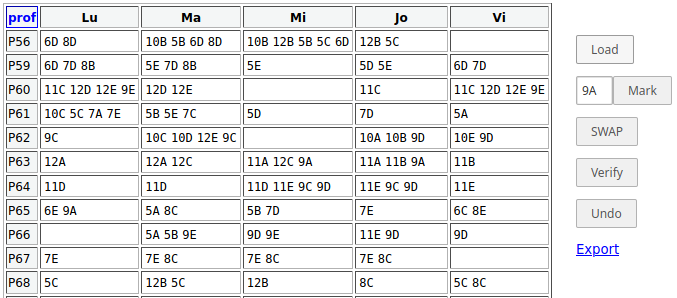

Asumăm că s-a produs cumva, o repartizare pe zilele de lucru a orelor profesorilor dintr-o şcoală; dar există câteva distribuţii individuale neconvenabile - de exemplu, există profesori care au *puţine* ore, iar acestea au fost repartizate iniţial, câte una pe zi. **recast** serveşte pentru redistribuirea interactivă a unui set dat de ore, cu păstrarea condiţiilor implicite moştenite prin extragerea acestui set din tabelul de repartizare iniţial (se menţine numărul de ore pe zi la fiecare clasă).

