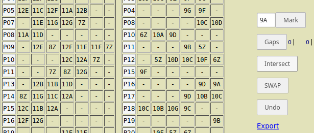

Asumăm că s-a produs cumva, o repartizare pe zilele de lucru a orelor profesorilor dintr-o şcoală; dar există câteva distribuţii individuale neconvenabile - de exemplu, există profesori care au *puţine* ore, iar acestea au fost repartizate iniţial, câte una pe zi. **recast** serveşte pentru redistribuirea interactivă a unui set dat de ore, cu păstrarea condiţiilor implicite moştenite prin extragerea acestui set din tabelul de repartizare iniţial (se menţine numărul de ore pe zi la fiecare clasă).

Iar **dayRecast** serveşte pentru modificarea interactivă a orarului unei zile. În fişierul "orar_Lu.csv" avem orarul iniţial al unei zile (pentru o şcoală cu 76 de profesori şi 41 de clase, funcţionând într-un singur schimb), conţinând 65 de ferestre; în final, în principal prin operaţiile "SWAP" şi "Undo" - ne-a rezultat un orar cu numai 10 ferestre (de câte o singură oră):

Dacă este vorba de o şcoală cu două schimburi, **pairRecast** poate servi pentru modificarea în paralel, a orarelor celor două schimburi:

